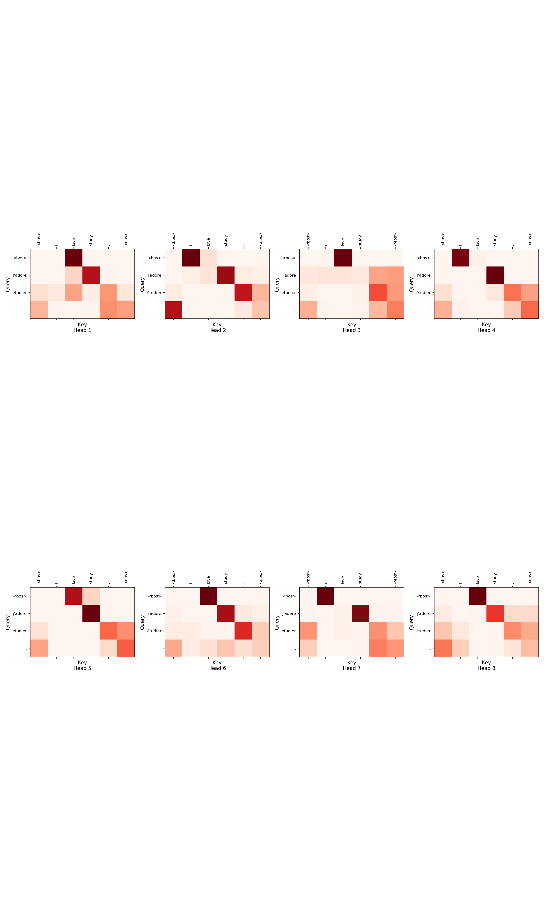

# Vanilla Python Implementation: Transformer

Vanilla Python implementation of Transformer.

## Dataset

English-French Dataset `data/eng-fra.txt`

## How to Run

See `bitahub_transformer.sh`.

Results are under `data/`.

## Attention Matrix

An example:

## TODO List

* Implement:

    > (from paper: Attention Is All You Need)
    >
    > In our model, we share the same weight matrix between the two embedding layers and the pre-softmax linear transformation, similar to [30].

    [stackoverflow](https://stackoverflow.com/questions/70308466/why-are-weight-matrices-shared-between-embedding-layers-in-attention-is-all-you)

* Add BLEU metric

* Do not drop the data that are not enough for a complete batch

* Save hyperparameters when saving model state dict in order to load checkpoint correctly (only load the state dict may cause bugs)

* Shuffle all data to form different batches for each epoch, but not just shuffle the order of batches

## References

[Attention Is All You Need](https://arxiv.org/pdf/1706.03762.pdf)

[numpy-transformer](https://github.com/AkiRusProd/numpy-transformer)

[d2l](https://d2l.ai/chapter_attention-mechanisms-and-transformers/transformer.html)

[zh.d2l](https://zh.d2l.ai/chapter_attention-mechanisms/transformer.html)

[positional encoding implementation](https://www.cnblogs.com/xiximayou/p/13343665.html)

...
